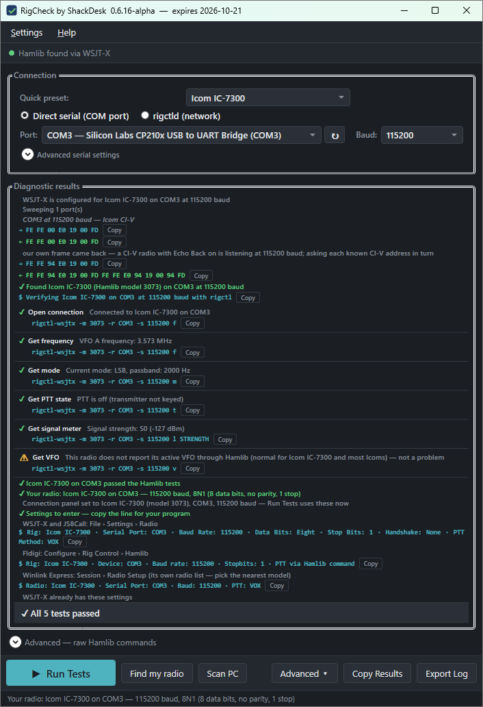
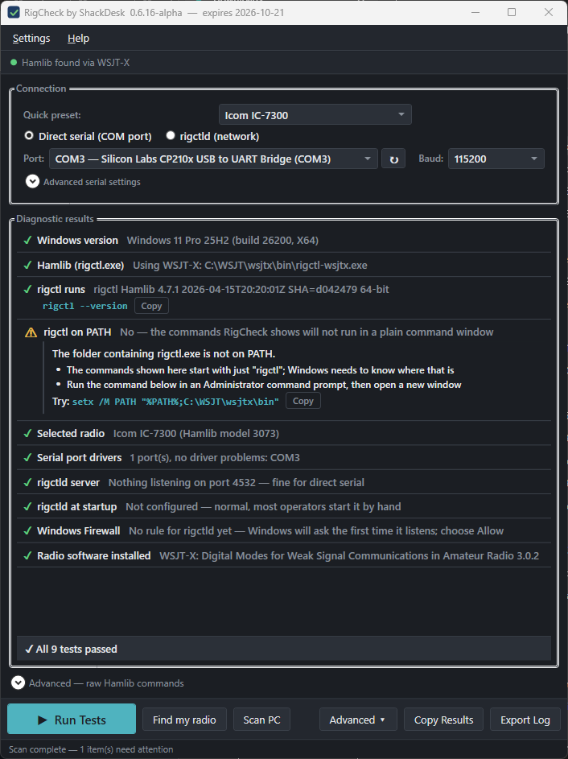
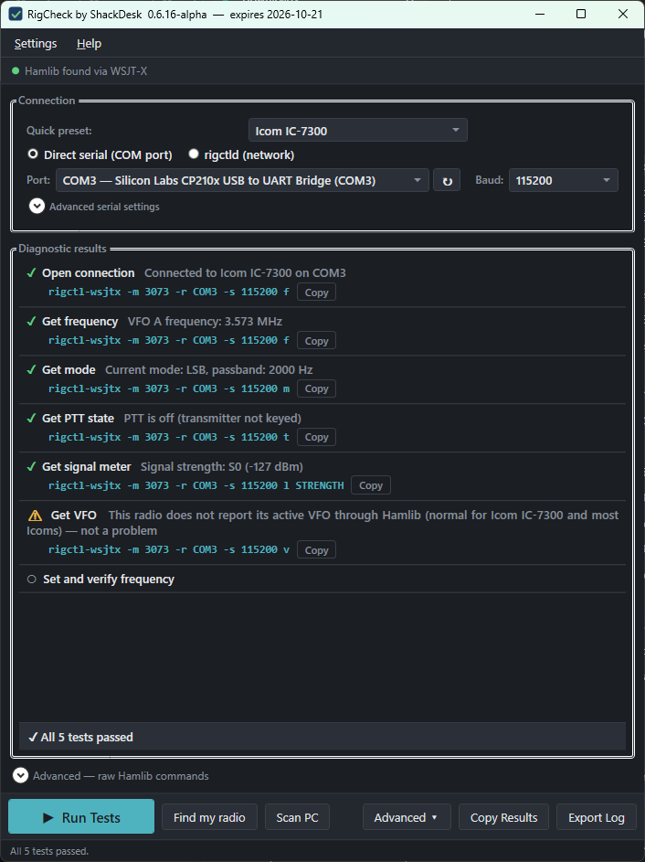

RigCheck is the second ShackDesk suite application.

[](LICENSE)

"Know your rig is ready."<br>



Serial CAT communication diagnostics using Hamlib. Verify your radio connection before it matters.

## Suite Context

Brand: ShackDesk<br>
Developer: Mark McDow N4TEK / My Computer Guru LLC<br>
GitHub: github.com/Computer-Tsu<br>
Suite site: shackdesk.com<br>
Technology: C# WPF .NET 10, MVVM architecture,
            dependency injection, Serilog logging,
            GitHub Actions CI/CD, no local compiler

## Platform

RigCheck runs on Windows 10 (version 21H2 or later)
and Windows 11, 64-bit. Nothing else needs to be
installed: the .NET runtime is bundled inside the
single RigCheck.exe.

Windows 11 on ARM runs it through the built-in x64
emulation. Windows 7 and 8.1 are not supported.

### Why .NET 10

RigCheck moved from .NET 8 to .NET 10 in September
2026. This changed nothing about which versions of
Windows it runs on — .NET 8 and .NET 10 support the
identical list of Windows client versions, and
neither supports Windows 7 or 8.1.

The reason is support lifetime. .NET 8 reaches end
of support on November 10, 2026, after which the
runtime bundled inside every RigCheck build would
stop receiving security fixes. .NET 10 is the
current long-term-support release, supported through
November 14, 2028.

### Build channels and expiry

RigCheck is published in three channels:

- **Alpha** — built from every change on the
  `develop` branch. **Alpha builds stop running
  30 days after they were built.** This keeps
  testers on current code and steers everyday
  users toward stable releases. The expiry date
  is shown in the window title and in Help >
  About. When an alpha expires, starting it shows
  a notice with a link to the latest build.
- **Beta** — built from a `v0.7.0-beta.1` tag on
  `main`, named `RigCheck-0.7.0-beta.1.exe` (no
  date or hash). Beta builds warn in the status
  bar 90 days after they were built but keep
  running.
- **Stable** — built from a `v0.7.0` tag on `main`,
  named `RigCheck-0.7.0.exe`. Never expires.

The window title shows the version, channel, and
expiry date, for example
`RigCheck by ShackDesk 0.6.2-alpha — expires 2026-10-21`.

### Where RigCheck keeps its files

RigCheck is a single portable exe and writes only
to your local application data folder. Nothing goes
in the registry.

```
%LOCALAPPDATA%\ShackDesk\RigCheck\
    rigcheck-settings.json   all settings, plain JSON
    Logs\                    daily log files, 7 kept
    Telemetry\               local copies of diagnostic reports
```

Delete `rigcheck-settings.json` to reset every
setting to its default.

RigCheck runs as a single instance: starting it
again brings the open window to the front. Settings › Logging shows
the log folder and can open or empty it.

### Anonymous diagnostics

On first launch RigCheck asks whether it may send
anonymous diagnostic reports. Nothing is sent
unless you say yes, and you can change the choice
in Settings at any time. Every report is also
stored locally and can be inspected under
Help > View collected data.

What is sent: the RigCheck and Windows versions,
whether Hamlib was found, and after each test run
the radio model, serial settings, USB cable
identifiers, and which tests passed or failed.
This is what improves the radio and cable
database for everyone.

Never sent: callsign, computer name, file paths,
serial numbers, or IP address. The only identifier
is a random ID created on first run, shown in
Help > About as a Support ID. Reports go to the
shared ShackDesk endpoint; see
shackdesk.com/privacy for the full policy.

### Hamlib

RigCheck does not include Hamlib. It finds the
rigctl.exe already on the computer from any of:

- WSJT-X (includes Hamlib) — wsjt.sourceforge.io
- Fldigi (includes Hamlib) — w1hkj.com
- Standalone Hamlib for Windows —
  github.com/Hamlib/Hamlib/releases

Most operators already have WSJT-X installed.

## RigCheck Purpose

Hamlib is the open source radio control library used
by virtually every digital mode program — WSJT-X, 
Fldigi, JS8Call, Winlink, and dozens more. When rig 
control does not work, diagnosing why is genuinely 
difficult for non-technical operators. Currently 
they must use cryptic command line tools.

RigCheck provides a friendly GUI front-end for 
testing and diagnosing Hamlib rig control connections.

Target users:
- Primary: Ham radio operators troubleshooting 
  why their rig control is not working in WSJT-X,
  Fldigi, JS8Call, Winlink, or other digital mode 
  software
- Secondary: Ham radio developers testing Hamlib 
  integration

## Core Features

### Connection Configuration
- Quick-start preset picker for popular radios (`Assets/radio_presets.json`), which fills
  the Hamlib model and serial defaults; every field can be overridden afterwards
- COM port list from Plug and Play, with the USB chip identified by VID/PID and a cable hint
  when it is a known radio interface (`Assets/usb_devices.json`)
- Baud rate: Radio default, or 1200 through 115200
- Data bits, parity, stop bits, flow control, and PTT method, each defaulting to
  "Radio default" so Hamlib's own model database decides
- Direct serial or rigctld network mode (host:port, default localhost:4532)
- Nothing is chosen for you: no port is auto-selected and the Hamlib dummy rig (model 1)
  is never a valid selection, so a passing result always means a real radio answered

### PC Scan (no radio needed)



The **Scan PC** button checks the computer side before any radio is
involved, so "Run Tests is greyed out — why?" has an answer:

- Windows version and architecture
- Every copy of Hamlib found (WSJT-X, Fldigi, standalone, PATH) and which one RigCheck uses
- `rigctl --version` actually runs
- Whether `rigctl` is on PATH — if not, the commands RigCheck shows will not work in a plain
  command window, and the exact `setx` line to fix it is shown
- The selected radio model, called out unmistakably when it is Hamlib's dummy rig (model 1)
- Serial port drivers: ports present, plus any Plug and Play device with a problem code
  (28 = no driver, 10 = cannot start, 22 = disabled)
- Whether anything is listening on the rigctld port (and Flrig's), and whether that matches
  the selected connection mode
- rigctld startup entries and Windows Firewall rules for it — a Block rule from a dismissed
  prompt is a classic
- Installed radio software (WSJT-X, Fldigi, JS8Call, Flrig, Winlink Express)

Everything is read-only. RigCheck never changes PATH, firewall rules, drivers, or startup
entries — it shows the command or the setting and leaves the change to you. The scan runs only
when you click it; nothing enumerates processes or ports at startup.

### Find my radio
When the operator does not know the port, the speed, or even which Hamlib
model to pick, **Find my radio** works it out:

1. The operator ticks the COM ports RigCheck may open (ports that look like a rotator,
   amplifier, GPS, or Bluetooth link start unticked).
2. Each port is swept with read-only queries — `ID;` for Kenwood, Elecraft, and Yaesu CAT
   rigs, CI-V read-ID and read-frequency for Icom, the five-byte read-frequency for the
   FT-817 family — at the baud rates that family is likely to use, most likely first. The
   radio already chosen in the Connection panel and the cable's USB chip move their family
   to the front of the queue.
3. A rig that names itself is looked up in `Assets/rig_ids.json`. One that only reports a
   frequency inside an amateur band is taken as its family's most likely model.
4. Every find is verified with the same Hamlib test suite as **Run Tests**, and the best
   verified one is written into the Connection panel.
6. A rigctld already listening on 4532 is reported as a working connection; Flrig on 12345
   is noted.

Everything sent and received is shown in the results panel, with a Copy button per line, and
goes into the exported log so the exchange can be replayed with a terminal program.

Safety rules that do not have a setting: RTS and DTR are never asserted (on many interfaces they
are PTT); only read commands are ever sent; the sweep runs only from the button and only on
ticked ports. The data files (`rig_families.json`, `rig_ids.json`, `port_skip_patterns.json`)
choose a built-in query by name and cannot contain command bytes. Design: `docs/discovery-flow.md`.

### Diagnostic Test Suite



Run a sequence of standard Hamlib queries and 
display pass/fail results in plain English:

Test 1: Open connection
  Pass: "Connected to [radio model] on [port]"
  Fail: diagnose reason (port busy, wrong baud, 
        no response, wrong model, timeout)

Test 2: Get frequency
  Pass: "VFO A frequency: 14.074 MHz"
  Fail: "Radio did not respond to frequency query"

Test 3: Get mode
  Pass: "Current mode: USB, passband: 3000 Hz"
  Fail: with diagnostic suggestion

Test 4: Get PTT state
  Pass: "PTT is off (transmitter not keyed)"
  Fail: with diagnostic suggestion

Test 5: Get signal meter (S-meter)
  Pass: "Signal strength: S7 (-85 dBm)"
  Fail: with diagnostic suggestion

Test 6: Get VFO
  Pass: "Active VFO: VFO A"
  Fail: with diagnostic suggestion

Test 7: Set and verify frequency (optional)
  User confirms before transmitter-affecting tests
  Sets a nearby frequency, reads back, verifies match
  Restores original frequency afterward

### Failure Diagnosis Engine
Map common failure patterns to plain English causes:

No response at all:
→ "No response from radio. Check: 
   Is the radio powered on?
   Is the correct COM port selected?
   Is the baud rate correct for your radio?
   Is another program already using this port?"

Port already in use:
→ "COM4 is already open by another program.
   Check if WSJT-X, Fldigi, or another 
   digital mode program is running."

Wrong radio model:
→ "Radio responded but returned unexpected data.
   The selected radio model may not match your 
   actual radio. Try searching for your exact 
   model number."

Timeout:
→ "Connection timed out. Check your cable 
   connection and verify the radio is set to 
   accept CAT commands. Consult your radio 
   manual for CAT/CI-V setup instructions."

rigctld not running:
→ "Could not connect to rigctld on localhost:4532.
   Verify rigctld is running and check the 
   host and port settings."

### Raw Command Console
Collapsible advanced panel for technical users:
- Text input to send raw Hamlib commands
- Response display
- Command history (up arrow recalls previous)
- Labeled: "Advanced — raw Hamlib commands"

### Common Radio Quick-Start Presets
Dropdown of popular radios with known-good settings:
- Icom IC-7300: USB, CI-V, 19200 baud
- Icom IC-705: USB, CI-V, 115200 baud  
- Yaesu FT-991A: USB, 38400 baud
- Yaesu FT-DX10: USB, 38400 baud
- Kenwood TS-590SG: USB, 115200 baud
- Elecraft K3: USB, 38400 baud
Selecting a preset fills all connection fields.
User can override any field after preset applied.

### Log Export
Save test results to a text file the user can 
email to a club Elmer or post to a support forum.
Format: plain text, human readable, not JSON.
Include: timestamp, radio model, port settings,
each test result, any error messages.

## Contributing

Radio and cable database entries, translations,
bug reports with an exported log, and code are all
welcome. See [CONTRIBUTING.md](CONTRIBUTING.md) and
[TRANSLATING.md](TRANSLATING.md). Translators are
credited in Help > About and in
[TRANSLATORS.md](TRANSLATORS.md).

## License

RigCheck is licensed under the GNU General Public
License, version 3. See [LICENSE](LICENSE).

RigCheck and ShackDesk are trademarks of My Computer
Guru LLC. See [LEGAL.md](LEGAL.md) for trademark and
third-party notices.

