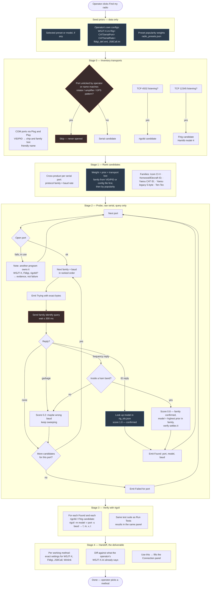

# Find my radio — discovery flow

Design document for RigCheck's discovery engine: how it goes from "I have a
cable plugged in somewhere" to "here are the exact settings to type into
WSJT-X". This is the living version; `discovery-flow.drawio` is the same
diagram for printing and editing in draw.io.

## Principles

- **Enumerate, don't stop.** Every working path is reported (direct serial,
  rigctld already running, Flrig), and the operator chooses. "Port in use" is
  evidence that another program already owns the radio, not a failure.
- **Query only.** Discovery sends read commands (identify, read frequency).
  It never sets frequency, mode, PTT, or anything else. Ports the operator
  unticks, and ports whose name matches a rotator, amplifier, or GPS pattern,
  are never opened.
- **Raw serial for discovery, rigctl for verification.** `rigctl` needs
  `-m <model>` up front, so it cannot discover a protocol. Discovery talks
  `System.IO.Ports.SerialPort` directly, keeps the handle open while sweeping
  baud rates, and hands the resolved model to `rigctl` for the real tests.
- **Families first, then models.** One `ID;` exchange confirms or eliminates
  the whole Kenwood/Elecraft/Yaesu-CAT family at that baud. The rig then names
  itself; RigCheck never has to guess a model from a list of 300.
- **Priors are data, the algorithm is code.** Candidate order comes from
  weights in JSON (preset popularity, VID/PID hints, what the operator's own
  WSJT-X.ini says). The data file selects from a fixed set of probe operations
  by name and never contains command bytes — an auto-updated data file must
  never be able to send arbitrary bytes at a transmitter.
- **Incremental.** The engine emits Trying / Found / Skipped / Failed / Done
  events with the exact bytes sent, as it goes. The results panel shows them
  live, the same stream becomes the exported log.

## Flow



## Probe operations (compiled, fixed set)

The data file chooses among these by name. Nothing else can be sent.

| Name | Family | Bytes sent | Expected reply | Notes |
|---|---|---|---|---|
| `KenwoodId` | Kenwood, Elecraft, Yaesu CAT | `ID;` | `IDnnn;` | One exchange identifies the model. Elecraft K3 and KX3 both answer `ID017;`; `OM;` tells them apart. |
| `IcomReadId` | Icom CI-V | `FE FE aa E0 19 00 FD` | `FE FE E0 aa 19 00 aa FD` | First sent to `00` (broadcast). Rigs act on broadcast but **never answer it**, so if only our own echo comes back (Echo Back on — the IC-7300 default) or nothing at all, the frame is re-sent to each CI-V address in `rig_ids.json`, the selected radio's first. The echo frame is skipped. Learned on a real IC-7300, 2026-09-21. |
| `IcomReadFreq` | Icom CI-V | `FE FE aa E0 03 FD` | `FE FE E0 aa 03 <BCD freq> FD` | Fallback for older rigs that do not answer `19 00`. |
| `YaesuLegacyReadFreq` | Yaesu FT-817/857/897 | `00 00 00 00 03` | 5 bytes: BCD freq + mode | Fixed 5-byte protocol, 4800/9600/38400 only. |
| `TenTecReadFreq` | Ten-Tec | `?A` + CR | `A` + 4 bytes | Rare; last in the order. |

Baud sweep order per family (data, `rig_families.json`):

| Family | Bauds, most likely first |
|---|---|
| Icom CI-V | 19200, 9600, 115200, 4800 |
| Kenwood / Elecraft | 115200, 38400, 9600, 4800 |
| Yaesu CAT | 38400, 4800, 9600, 19200 |
| Yaesu legacy | 4800, 9600, 38400 |

## Rig identity table (data, `rig_ids.json`)

Maps a reply to a Hamlib model number. Contributors can add rigs by pull
request without compiling anything.

| Family | Reply | Radio | Hamlib model |
|---|---|---|---|
| Kenwood | `ID021;` | TS-590S | 2031 |
| Kenwood | `ID023;` | TS-590SG | 2037 |
| Kenwood | `ID024;` | TS-890S | 2041 |
| Elecraft | `ID017;` | K3 / KX3 / KX2 (see `OM;`) | 2029 / 2045 / 2044 |
| Yaesu | `ID0670;` | FT-991A | 1035 |
| Yaesu | `ID0650;` | FT-891 | 1036 |
| Yaesu | `ID0761;` | FT-DX10 | 1042 |
| Yaesu | `ID0681;` | FTDX101D | 1040 |
| Icom | CI-V `94` | IC-7300 | 3073 |
| Icom | CI-V `A4` | IC-705 | 3085 |
| Icom | CI-V `98` | IC-7610 | 3078 |
| Icom | CI-V `A2` | IC-9700 | 3081 |

Values above are the starting set and are verified against Hamlib's
`riglist.h` before shipping; corrections welcome.

## Skip patterns (data, `port_skip_patterns.json`)

Ports whose friendly name contains any of these are never opened by
discovery. Stray bytes to a rotator or amplifier controller are a
real-world hazard.

`rotor`, `rotator`, `GS-232`, `amplifier`, `SPE Expert`, `GPS`, `u-blox`,
`NMEA`, `Garmin`, `Bluetooth`

## Events

```
Trying   { port, family, baud, bytesSent }
Found    { port, family, baud, model, modelName, reply }
Skipped  { port, reason }            // excluded, pattern match, in use
Failed   { port }                    // every candidate exhausted
Verified { method, suite results }
Done     { methods[] }
```

Each event renders one line in the results document (`TranscriptKind`), so
the operator watches the sweep as it happens and can copy any line to
reproduce it with a terminal program.

## Not in scope for the first version

- OmniRig and LAN-connected rigs (inventory only — no probe).
- Fldigi's own configuration as a clue (it stores baud as a list index and
  models in its own numbering); WSJT-X and JS8Call are read.
- Telemetry-weighted priors (needs volume first).
- Aggressive probing (see below).

## What counts as identified

A working exchange that the verify stage confirms is enough. If a rig
answers a frequency query with a plausible value but never names itself,
the engine takes the highest-prior model in that family (from the preset
selected, the operator's own config, or popularity) and hands it to
`rigctl`. If the verify suite passes, the model, port, and speed are
reported as found — the operator is not asked to pick from a list.

## Aggressive probing (future, Advanced option)

The default sweep sends only the identify and read-frequency queries above.
An **Aggressive** option under Advanced will send more queries per
candidate — additional read commands, more baud rates, more families —
accepting that some rigs will log an error or briefly show confusion at an
unrecognised command. The premise is that no read command in the set can
damage a radio or change its state; the trade is a longer, noisier sweep
for a better chance of a match on rare or older rigs. Off by default, and
still query-only: the aggressive set is a larger allowlist, never a
different kind of command.

## Other devices (future)

The same engine shape — inventory, classify, rank, query-only probe, verify,
handoff — applies to the other serial devices in a shack: rotators (GS-232
and the Yaesu/Hy-Gain/Green Heron dialects), GPS receivers (NMEA arrives
unprompted, so the probe is listen-only), amplifiers, and logging or
contest software links. `port_skip_patterns.json` already classifies ports
by `DeviceClass`; a "Find my rotator" or "Find my GPS" mode would probe
exactly the ports Find my radio refuses to touch, with its own family and
identity tables. Not scheduled yet.
